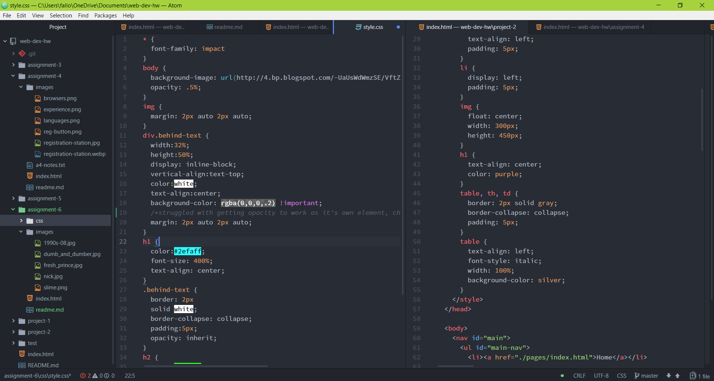

# README for A6

For this assignment, I chose to go with the 90s theme because I was *almost* a 90s kid! I chose the image that looked like the nickolodean symbol because I instantly thought of a fun color pallette. I showed this decades trends through the designs by incorporating bright colors and the green slime background which was represative of when Nickolodean used to "slime" contestants of the show.

The colors I chose for this assignment,as stated before, were very bright. I frequently used the color "white", because the background is green, I wanted a color that was less distracting. Further, for some areas of text, I used the color "black". The other bright colors I used were HEX values: #2efaff and #2bfc26.

My process for this assignment went smoothly, but I spent most of my time switching between different examples of CSS in order to get things to look exactly how I wanted. Also, I was frequently uploading my progress to Github to check how my page would appear in the web browser.

Here is a picture of my workspace towards the end of my cycle!

 
