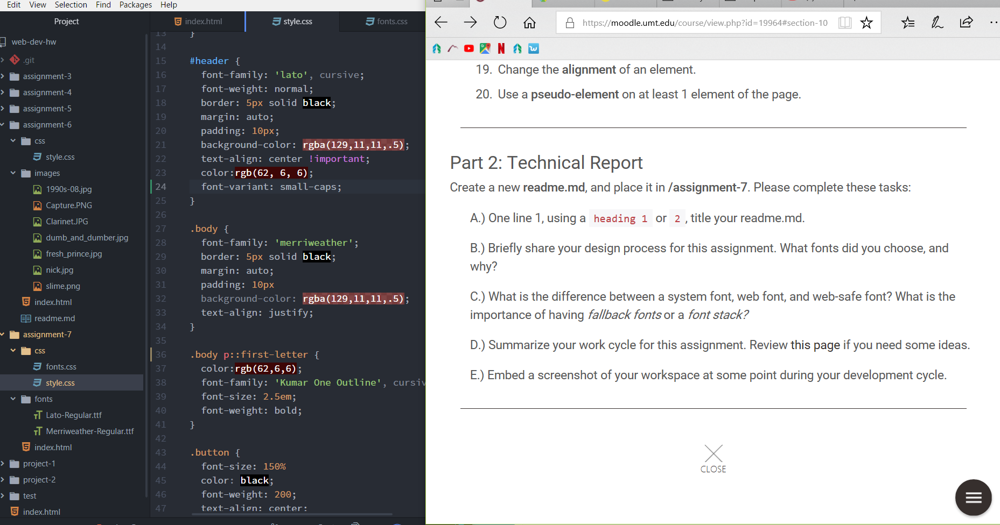

# README for A7

For this assignment, I chose to focus on the excerpt from Stephen King because it is my favorite author. I thought I would have more fun picking a font, but it was hard to find a font combination that was 'scary' but not too cheesy to take away from the typography. Further, I ended up choosing very simple looking fonts because they made it easier for the reader to read.

Because I felt held back from using crazy fonts, I chose to go with colors such as reds, blacks, and whites, to look somewhat creepy.

There are three different types of fonts, a system based font, web font, and web-safe font. A system font changes depending on the system that the user is rendering. Therefore, mac and windows have different fonts. contrasting this, there are fonts available for download, but it is not guaranteed that it will be viewed the same on all browsers. Further, it is important to have a fallback font, so that the page is viewed ideally how the developer wants their page to be viewed.

