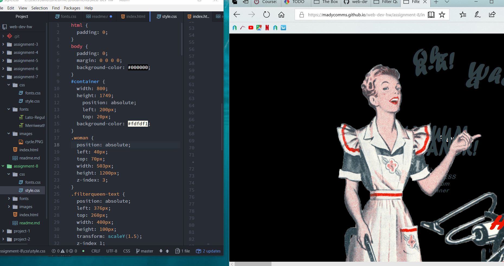

# README for A8

1. padding is the spacing between content and the border whereas a margin is the area outside of the element. A border is the frame around an element that can be style differently.

2. The hardest task for me in this assignment is working with so many different divs and then trying to space and style them accordingly.
As it may be viewed below, I struggled a lot with layout!

3. My work cycle for this assignment consisted of flipping between the book frantically and pulling up multiple tabs to try to adjust things in order to get them to appear how I wanted.
